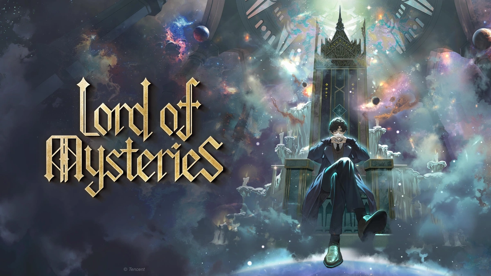

<div align="center">



# Lord of the Mysteries — Sistema Foundry VTT

*"La nebbia non mente mai, ma non dice mai tutta la verità."*

[](https://github.com/KerrhinDev/foundryvtt-lotm/releases/latest)
[](https://foundryvtt.com)
[](#)
[](LICENSE)

</div>

---

## ✦ Cos'è questo sistema?

Un sistema completo per **Foundry VTT** basato su *Lord of the Mysteries* (*Il Signore dei Misteri*), il romanzo di **Cuttlefish That Loves Diving**.  
Permette di giocare sessioni di ruolo ambientate nel mondo Vittoriano/Steampunk di Beyonder, con meccaniche fedeli all'universo del romanzo.

---

## ⚗️ Funzionalità

### 📋 Scheda Personaggio (PG)
| Sezione | Contenuto |
|---|---|
| **Attributi** | 8 attributi (Forza, Agilità, Percezione…) con valori Fondamentale, Beyonder, Corruzione e Bonus |
| **Risorse** | Vita · Spirito · Razionalità · Punti Fortuna con barre visive in tempo reale |
| **Sequenze** | Tabella Sequenze 0–9 con bonus danno automatico e info percorso corrente |
| **Avanzamento** | Bottone ⬡ Avanza — dialog di conferma rituale + chat card di avanzamento |
| **Difesa** | Difesa fisica e mentale calcolate automaticamente |
| **Skills** | Abilità personalizzabili con tiro integrato |
| **Tab** | Panoramica · Difesa · Abilità · Poteri · Inventario · Note |

### 👹 Scheda PNG (NPC)
- Sheet dedicato e snello per nemici e personaggi non giocanti
- Vita e Spirito con barre grandi e visibili
- 5 attributi con tiro rapido integrato
- Livello di minaccia (stelle ★) e tipo (Gregario / Élite / Capo / Unico)
- Tab Statistiche · Poteri · Note

### 🎲 Sistema Dadi
- Dialogo tiro avanzato: **dado bonus**, **DC** configurabile, **Normale / Vantaggio / Svantaggio**
- Chat card stilizzata con indicatore **Successo / Fallimento** colorato
- Tiri generici da formula

### 🃏 Tarocchi Interattivi
- 22 Arcani Maggiori corrispondenti ai 22 Percorsi Beyonder
- Carte face-down cliccabili per rivelare
- Pesca casuale, shuffle del mazzo, invio carta al chat
- Apri con `/tarot` nel chat o tramite macro

### 🎭 Token
- Barre tracciabili sul token: **Vita**, **Spirito**, **Razionalità**, **Punti Fortuna**

### 🌀 Effetti di Stato LotM
Effetti personalizzati con icone tematiche visibili sul token:
- **Contaminazione** Lieve / Moderata / Grave
- **Follia** Lieve / Profonda
- Avvelenamento da Pozione
- Maledizione · Benedizione Beyonder

### 📚 Compendio (da popolare con macro)
| Pack | Contenuto |
|---|---|
| **Abilità dei Percorsi** | Tutti i **22 percorsi** × 10 Sequenze × 3 abilità (~660 voci) |
| **Macro LotM** | Iniziativa · Riposo Breve · Riposo Lungo · Punto Fortuna · Tarocchi · Avanza Sequenza |
| **Tabelle Casuali** | Sussurri nella Nebbia · Incontri a Backlund · Conseguenze Rituali · Voci del Mercato Nero |

> **Primo avvio:** esegui le macro `populate-compendium.mjs`, `seed-macros.mjs`, `seed-tables.mjs` per popolare i pack.

### 🎨 Grafica
- Tema visivo ispirato all'estetica **Vittoriana e mistica** del romanzo
- Palette: blu notte · viola Beyonder · oro rituale
- Texture nebbia, glow sulle card attributi, chat card tematizzate

---

## 📦 Installazione

### Tramite Foundry VTT (consigliato)
1. Apri Foundry VTT → **Gestione Sistemi**
2. Clicca **Installa Sistema**
3. Incolla il manifesto e clicca **Installa**:
```
https://raw.githubusercontent.com/KerrhinDev/foundryvtt-lotm/main/system.json
```

### Manuale
1. Scarica `lotm.zip` dalla [pagina releases](https://github.com/KerrhinDev/foundryvtt-lotm/releases/latest)
2. Estrai nella cartella `Data/systems/` di Foundry VTT
3. Riavvia Foundry

---

## 🔧 Compatibilità

| Foundry VTT | Stato |
|---|---|
| V14 (Build 360+) | ✅ Verificato |
| V13 | ✅ Compatibile |
| V12 | ✅ Compatibile |

---

## 📖 Struttura del Progetto

```
lotm/
├── module/
│   ├── lotm.mjs                  # Entry point
│   ├── data/
│   │   ├── actor-character.mjs   # DataModel PG
│   │   └── actor-npc.mjs         # DataModel PNG
│   ├── documents/                # Actor & Item estesi
│   ├── sheets/
│   │   ├── character-sheet.mjs   # Scheda PG
│   │   └── npc-sheet.mjs         # Scheda PNG
│   ├── apps/
│   │   ├── dice-dialog.mjs       # Dialog tiro avanzato
│   │   └── tarot-app.mjs         # App Tarocchi interattiva
│   └── macros/                   # Macro di seeding compendio
├── templates/
│   ├── actor/                    # HBS sheets PG e PNG
│   └── apps/                     # HBS Tarocchi
├── css/
│   └── lotm.css                  # Tema visivo LotM
├── assets/
│   ├── banner.webp               # Immagine header
│   └── icons/                    # Icone effetti di stato SVG
├── lang/
│   ├── it.json                   # Italiano
│   └── en.json                   # English
├── packs/
│   ├── lotm-abilities/           # Compendio abilità
│   ├── lotm-macros/              # Compendio macro
│   └── lotm-tables/              # Compendio tabelle
└── system.json                   # Manifesto sistema
```

---

## 🗺️ I 22 Percorsi Beyonder

| Arcano | Percorso | Arcano | Percorso |
|---|---|---|---|
| 0 — Il Folle | Veggente → Fonte della Magia | XI — La Giustizia | Soldato → La Giustizia |
| I — Il Mago | Studente → Il Mago | XII — L'Appeso | Prigioniero → L'Appeso |
| II — La Sacerdotessa | Spettatore → La Sacerdotessa | XIII — La Morte | Non Morto → La Morte |
| III — L'Imperatrice | Bardo → L'Imperatrice | XIV — La Temperanza | Sacerdote → La Temperanza |
| IV — L'Imperatore | Farmacista → L'Imperatore | XV — Il Diavolo | Schiavo → Il Diavolo |
| V — Il Papa | Marinaio → Il Papa | XVI — La Torre | Fuochista → La Torre |
| VI — Gli Amanti | Chiaroveggente → Gli Amanti | XVII — La Stella | Osservatore → La Stella |
| VII — Il Carro | Avventuriero → Il Carro | XVIII — La Luna | Licantropo → La Luna |
| VIII — La Forza | Artigiano → La Forza | XIX — Il Sole | Fotomante → Il Sole |
| IX — L'Eremita | Assassino → L'Eremita | XX — Il Giudizio | Predicatore → Il Giudizio |
| X — La Ruota | Fortunato → La Ruota | XXI — Il Mondo | Animista → Il Mondo |

---

## 🤝 Contribuire

PR e issue benvenute! Se conosci bene i percorsi Beyonder e vuoi aiutare ad espandere il compendio delle abilità, sei il benvenuto.

---

## 📝 Changelog

### v1.1.10
- 🔧 Fix critico: `getRollData()` non muta più il DataModel V14 — oggetto plain per le formule Roll

### v1.1.9
- 🔧 Sheets: listener registrati con DOM nativo (`querySelectorAll` + `addEventListener`) — fix per V14 dove jQuery può non essere disponibile
- 🔧 Dialog dadi: state tracking in tempo reale tramite `render` callback — lettura form non dipende più dal DOM al momento del click
- 🔧 Hook `renderChatMessageHTML` aggiunto per V13/V14 (in aggiunta al vecchio `renderChatMessage` per V12)
- 🔧 Rimosso campo `type` da tutti i `ChatMessage.create` — in V13/V14 `type` è riservato al sottotipo documento; `ROLL` è inferito automaticamente da `rolls`
- 🔍 Aggiunto logging di debug in console per diagnosi problemi

### v1.1.8
- 🔧 Fix critico V14: tiri attributi, abilità e avanzamento sequenza ora inviano correttamente messaggi in chat
- 🔧 Dialog dadi: rewrite compatibile V14 — lettura form via `querySelector` invece di jQuery
- 🔧 Hook `chatMessage`: aggiunto type guard su `message` (fix crash V14)
- 🔧 Hook `renderChatMessage`: compatibilità jQuery/HTMLElement per V14
- 🔧 `item.use()` e `advanceSequence()`: errori chat ora mostrano notifica anziché fallire silenziosamente

### v1.1.7
- 🔧 Avanzamento Sequenza: rimosso dialog di conferma, avanza e invia messaggio chat direttamente

### v1.1.6
- 🔧 Avanzamento Sequenza: sostituito `Dialog.confirm()` con `Dialog` manuale (fix V14 — il messaggio chat ora viene sempre inviato)
- 🔧 Compendio abilità: sequenze 6 e sotto classificate come `ritual` invece di `active`

### v1.1.5
- ✨ Aggiunta opzione "Senza Sequenza" nel dropdown sequenze (non appare nella tabella di riferimento)

### v1.1.4
- ⚔️ Iniziativa: formula `1d20 + Agilità` tramite `getRollData()`

### v1.1.3
- 🖼️ Aggiunto campo `background` in system.json — banner LotM visibile nella schermata di selezione mondo

### v1.1.2
- 🔧 Rimossa registrazione effetti di stato personalizzati — causava crash `ownKeys proxy` su Foundry V14

### v1.1.1
- 🔧 `system.json`: rimosso campo `version` duplicato che causava conflitti di parsing
- 🔧 `item.use()`: aggiunto type guard — gli oggetti Equipment non scatenano più errori JS

### v1.1.0
- ✨ Scheda PNG dedicata (NPC sheet)
- ✨ Tarocchi interattivi — 22 Arcani Maggiori (comando `/tarot`)
- ✨ Sistema avanzamento Sequenza con dialog rituale
- ✨ Effetti di stato LotM (contaminazione, follia, veleno, maledizione…)
- ✨ Chat card abilità migliorate con dettagli inline
- ✨ Compendio completo — tutti i 22 percorsi Beyonder
- ✨ Pack Macro precostruite (iniziativa, riposo, punti fortuna…)
- ✨ Pack Tabelle casuali (Backlund, nebbia, rituali, mercato nero)

### v1.0.0
- 🎉 Prima release pubblica
- Scheda PG completa con 8 attributi e risorse
- Sistema dadi avanzato (vantaggio/svantaggio/DC)
- Barre token tracciabili
- Tema grafico LotM

---

<div align="center">

*Artwork © Tencent / Lord of the Mysteries Production Committee*  
Sistema realizzato dalla community per la community.  
**"Above the Fog, there is a being like God."**

</div>
